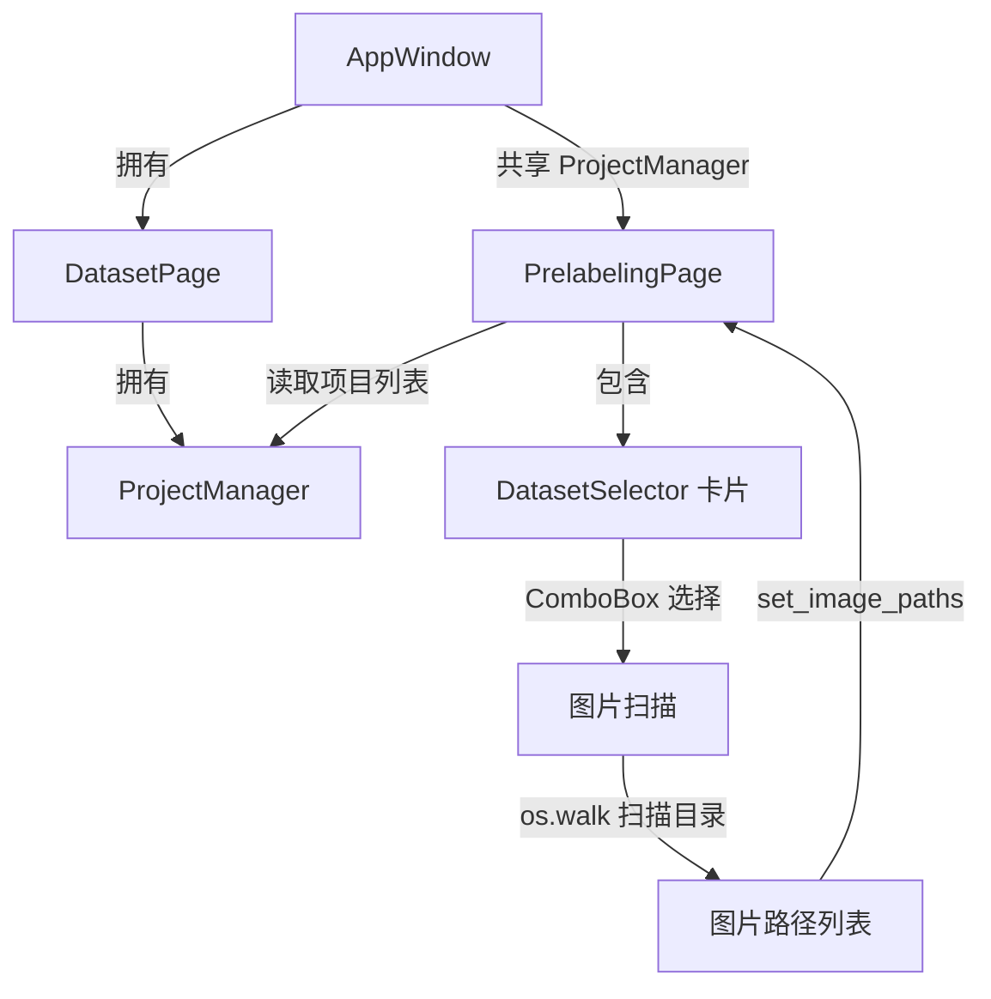
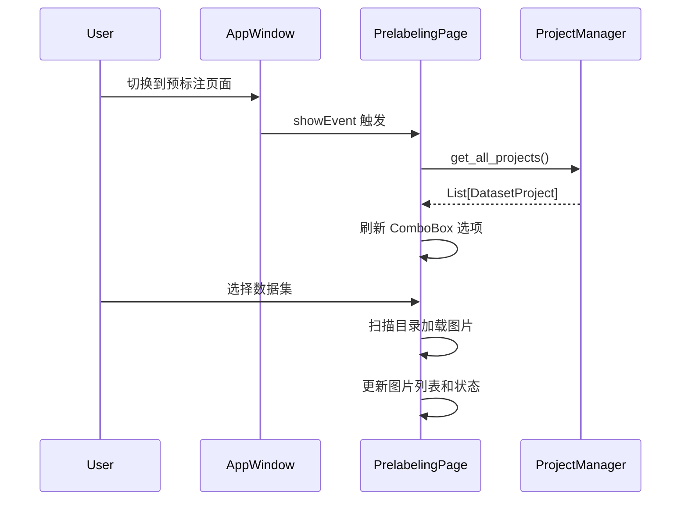

# 设计文档：预标注数据集选择器

## 概述

本功能为预标注页面（PrelabelingPage）添加一个数据集选择器组件，使用户可以在预标注页面直接选择要操作的数据集项目。核心改动集中在 `prelabeling_page.py`，通过复用现有的 `ProjectManager` 和图片扫描逻辑，在预标注页面嵌入一个 ComboBox 下拉框实现数据集选择。同时需要调整 `main_window.py` 中的页面切换逻辑，将 `ProjectManager` 实例共享给预标注页面，并在页面可见时触发刷新。

## 架构

### 组件交互



### 页面切换流程



## 组件与接口

### 1. PrelabelingPage 修改

在现有 `PrelabelingPage` 类中添加以下内容：

**新增属性：**
- `_project_manager: ProjectManager` — 共享的项目管理器引用
- `_current_project_id: Optional[str]` — 当前选中的项目 ID

**新增 UI 元素（数据集选择器卡片）：**
- `dataset_combo: ComboBox` — qfluentwidgets 的 ComboBox 组件
- `dataset_info_label: CaptionLabel` — 显示当前数据集信息（图片数量等）

**新增方法：**

```python
def set_project_manager(self, manager: ProjectManager) -> None:
    """设置项目管理器引用（由 AppWindow 调用）"""

def _create_dataset_card(self) -> CardWidget:
    """创建数据集选择器卡片"""

def _refresh_dataset_list(self) -> None:
    """刷新 ComboBox 中的数据集项目列表，保持当前选中项"""

def _on_dataset_changed(self, index: int) -> None:
    """ComboBox 选择变化时的回调，触发图片扫描"""

def _scan_project_images(self, project: DatasetProject) -> None:
    """扫描项目目录下的所有图片文件"""

def showEvent(self, event) -> None:
    """重写 showEvent，页面可见时刷新数据集列表"""
```

**修改方法：**
- `_setup_ui()` — 在 API 配置卡片之前插入数据集选择器卡片
- `_on_start_clicked()` — 修改验证逻辑，检查是否已选择数据集
- `_set_running_state()` — 添加 ComboBox 的启用/禁用控制

### 2. AppWindow 修改

**修改内容：**
- 在初始化时调用 `prelabeling_page.set_project_manager(dataset_page.project_manager)` 共享 ProjectManager
- 移除 `_on_page_changed` 中自动同步图片的逻辑（由数据集选择器接管）

### 3. 图片扫描逻辑

复用 `dataset_page.py` 中已有的 `SUPPORTED_IMAGE_FORMATS` 常量和 `os.walk` 扫描模式。在 `PrelabelingPage` 中实现一个轻量级的同步扫描方法（预标注页面不需要缩略图和标注统计，只需要图片路径列表）：

```python
def _scan_project_images(self, project: DatasetProject) -> None:
    image_paths = []
    for root, _, files in os.walk(project.directory):
        for f in files:
            if Path(f).suffix.lower() in SUPPORTED_IMAGE_FORMATS:
                image_paths.append(os.path.join(root, f))
    image_paths.sort()
    self._image_paths = image_paths
```

对于大型数据集目录，扫描可能耗时较长。但考虑到：
- 预标注页面只需要路径列表，不需要解析标注文件或加载缩略图
- 扫描操作在用户选择数据集时触发，频率较低
- 如果未来需要，可以轻松改为异步扫描

当前设计采用同步扫描以保持实现简洁。

## 数据模型

### 复用现有数据模型

本功能不引入新的数据模型，完全复用 `dataset_page.py` 中已定义的：

- `DatasetProject` — 数据集项目数据类
- `ProjectManager` — 项目管理器（读取项目列表）
- `SUPPORTED_IMAGE_FORMATS` — 支持的图片格式集合

### ComboBox 数据映射

ComboBox 的每个选项通过 index 与项目 ID 对应：

| ComboBox Index | 显示文本 | 关联数据 |
|---|---|---|
| 0 | "项目A (120 张图片)" | project_id_1 |
| 1 | "项目B (85 张图片)" | project_id_2 |
| ... | ... | ... |

使用一个列表 `_project_ids: List[str]` 维护 index 到 project_id 的映射关系。


## 正确性属性

*属性是指在系统所有有效执行中都应成立的特征或行为——本质上是关于系统应该做什么的形式化陈述。属性是人类可读规范与机器可验证正确性保证之间的桥梁。*

基于 prework 分析，以下属性从验收标准中提取：

### Property 1: ComboBox 与项目列表同步

*For any* 项目列表（包含任意数量的 DatasetProject），刷新 ComboBox 后，ComboBox 的选项数量应等于项目数量，且每个选项的文本应包含对应项目的名称和图片数量。

**Validates: Requirements 1.2, 1.4**

### Property 2: 图片扫描完整性

*For any* 包含图片文件的目录结构，扫描该目录后返回的图片路径列表应包含且仅包含该目录下所有扩展名属于 SUPPORTED_IMAGE_FORMATS 的文件。

**Validates: Requirements 2.1**

### Property 3: 刷新后保持选中项

*For any* 项目列表和任意已选中的项目 ID，当刷新 ComboBox 后，如果该项目 ID 仍存在于新的项目列表中，则 ComboBox 的当前选中项应对应该项目 ID。

**Validates: Requirements 3.2**

## 错误处理

| 场景 | 处理方式 | 对应需求 |
|---|---|---|
| 项目目录不存在 | 显示 InfoBar 错误提示，清空图片列表，日志记录 | 2.3 |
| 项目列表为空 | ComboBox 显示占位文本，禁用开始按钮 | 1.3 |
| 未选择数据集就开始预标注 | 显示 InfoBar 警告提示"请先选择数据集" | 4.1 |
| 刷新后选中项已删除 | 清空选择状态，清空图片列表 | 3.3 |
| 扫描目录时权限不足 | 捕获 OSError，显示错误提示，日志记录 | — |

## 测试策略

### 属性测试

使用 `hypothesis` 库进行属性测试，每个属性至少运行 100 次迭代。

- **Property 1 (ComboBox 与项目列表同步)**: 生成随机的 DatasetProject 列表，调用 `_refresh_dataset_list()`，验证 ComboBox 选项数量和文本内容。
  - Tag: **Feature: prelabeling-dataset-selector, Property 1: ComboBox 与项目列表同步**

- **Property 2 (图片扫描完整性)**: 使用临时目录生成随机的文件结构（包含支持和不支持的格式），调用扫描方法，验证返回的路径列表。
  - Tag: **Feature: prelabeling-dataset-selector, Property 2: 图片扫描完整性**

- **Property 3 (刷新后保持选中项)**: 生成随机项目列表和选中项，执行刷新，验证选中状态保持。
  - Tag: **Feature: prelabeling-dataset-selector, Property 3: 刷新后保持选中项**

### 单元测试

单元测试覆盖边界情况和特定示例：

- 空项目列表时的占位文本显示（需求 1.3）
- 目录不存在时的错误处理（需求 2.3）
- 刷新后选中项被删除时的清空行为（需求 3.3）
- 未选择数据集时点击开始的验证（需求 4.1）
- 运行状态下 ComboBox 禁用/启用切换（需求 4.3, 4.4）

### 测试框架

- 测试框架: `pytest`
- 属性测试库: `hypothesis`
- GUI 测试: `pytest-qt`（用于 PyQt5 组件测试）
- 每个属性测试对应一个独立的测试函数
- 每个属性测试必须引用设计文档中的属性编号
