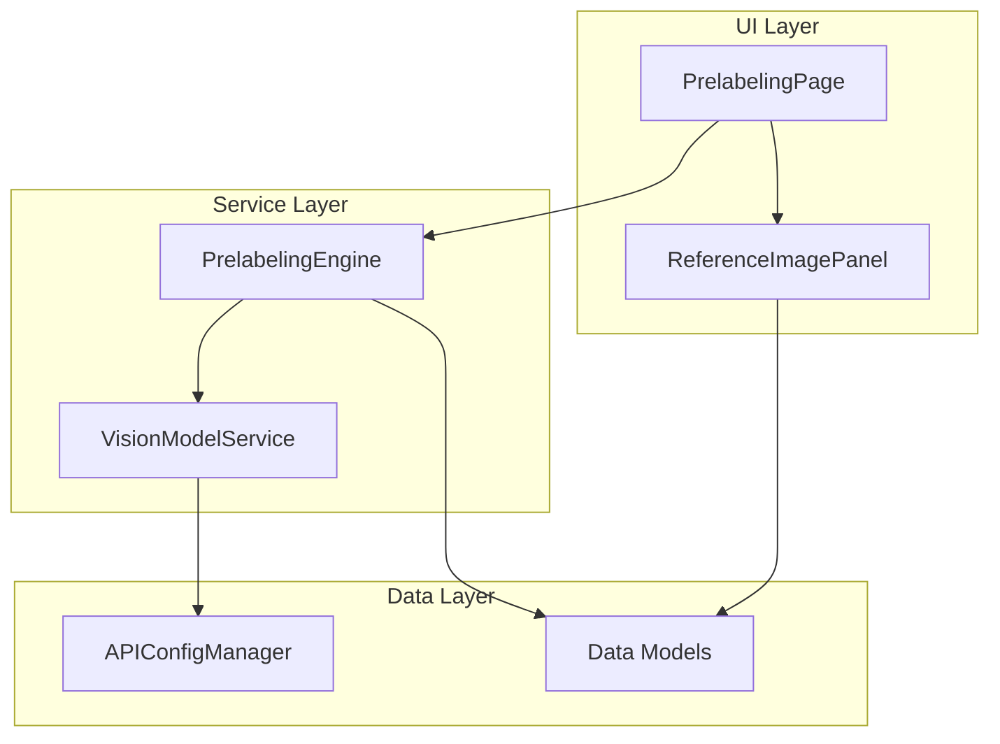

# 设计文档

## 概述

本设计扩展现有的预标注系统，添加参考图片功能。用户可以提供一张或多张参考图片，让视觉模型根据参考图片来识别和定位待标注图片中的相同或相似目标。

设计遵循现有代码架构，主要修改以下模块：
- `prelabeling_page.py` - 添加参考图片面板 UI
- `vision_service.py` - 扩展 API 请求构建以支持多图片
- `engine.py` - 扩展预标注引擎以传递参考图片
- `models.py` - 添加参考图片相关数据模型

## 架构



## 组件与接口

### 1. ReferenceImagePanel（新增组件）

参考图片管理面板，作为 `PrelabelingPage` 的子组件。

```python
class ReferenceImagePanel(QWidget):
    """参考图片管理面板"""
    
    # 信号
    images_changed = pyqtSignal(list)  # 参考图片列表变化时发出
    
    MAX_IMAGES = 10
    THUMBNAIL_SIZE = (80, 80)
    
    def __init__(self, parent=None):
        ...
    
    def add_images(self, paths: List[str]) -> List[str]:
        """添加参考图片，返回成功添加的路径列表"""
        ...
    
    def remove_image(self, path: str) -> None:
        """移除指定参考图片"""
        ...
    
    def clear_all(self) -> None:
        """清空所有参考图片"""
        ...
    
    def get_image_paths(self) -> List[str]:
        """获取当前参考图片路径列表"""
        ...
    
    def _validate_image(self, path: str) -> bool:
        """验证图片格式是否支持"""
        ...
    
    def _create_thumbnail(self, path: str) -> QPixmap:
        """创建图片缩略图"""
        ...
```

### 2. VisionModelService 扩展

扩展现有的 `VisionModelService` 以支持参考图片模式。

```python
class VisionModelService:
    # 新增方法
    
    def build_reference_image_payload(
        self,
        reference_images: List[Tuple[str, str]],  # [(base64, mime_type), ...]
        target_image: Tuple[str, str],  # (base64, mime_type)
        user_description: str = ""
    ) -> dict:
        """构建包含参考图片的 API 请求体"""
        ...
    
    def generate_reference_prompt(
        self,
        num_references: int,
        user_description: str = ""
    ) -> str:
        """生成参考图片模式的提示词"""
        ...
    
    def detect_objects_with_reference(
        self,
        reference_paths: List[str],
        target_path: str,
        user_description: str = ""
    ) -> DetectionResult:
        """使用参考图片进行目标检测"""
        ...
```

### 3. PrelabelingWorker 扩展

扩展现有的 `PrelabelingWorker` 以支持参考图片模式。

```python
class PrelabelingWorker(QThread):
    def __init__(
        self,
        image_paths: List[str],
        prompt: str,
        vision_service: VisionModelService,
        skip_annotated: bool = True,
        overwrite: bool = False,
        max_workers: int = 1,
        # 新增参数
        reference_images: List[str] = None,
        detection_mode: str = "text_only"  # "text_only" | "reference_image"
    ):
        ...
```

### 4. DetectionMode 枚举（新增）

```python
from enum import Enum

class DetectionMode(Enum):
    TEXT_ONLY = "text_only"
    REFERENCE_IMAGE = "reference_image"
```

## 数据模型

### 新增数据模型

```python
@dataclass
class ReferenceImageInfo:
    """参考图片信息"""
    path: str
    thumbnail_path: str = ""
    is_valid: bool = True
    error_message: str = ""
```

### 扩展 VisionAPIConfig

无需修改，现有配置足够支持参考图片功能。

## 正确性属性

*正确性属性是指在系统所有有效执行中都应保持为真的特征或行为——本质上是关于系统应该做什么的形式化陈述。属性作为人类可读规范和机器可验证正确性保证之间的桥梁。*

### Property 1: 图片格式验证一致性

*对于任意* 文件路径，如果文件扩展名在支持的格式列表中（jpg、jpeg、png、bmp、webp），则 `_validate_image` 应返回 True；否则应返回 False。

**验证: 需求 1.2, 1.3**

### Property 2: 添加图片后列表状态一致性

*对于任意* 有效图片路径列表，添加这些图片后，`get_image_paths()` 返回的列表应包含所有成功添加的路径，且 `get_image_count()` 应等于成功添加的图片数量。

**验证: 需求 1.4, 2.4**

### Property 3: 删除图片后列表状态一致性

*对于任意* 已添加的参考图片，删除该图片后，`get_image_paths()` 返回的列表不应包含该图片路径，且列表长度应减少 1。

**验证: 需求 2.2**

### Property 4: 清空操作幂等性

*对于任意* 参考图片面板状态，执行 `clear_all()` 后，`get_image_paths()` 应返回空列表，且 `get_image_count()` 应为 0。

**验证: 需求 2.3**

### Property 5: 模式切换面板可见性一致性

*对于任意* 检测模式值，当模式为 `REFERENCE_IMAGE` 时参考图片面板应可见，当模式为 `TEXT_ONLY` 时参考图片面板应隐藏。

**验证: 需求 3.2, 3.3**

### Property 6: API 请求体图片编码完整性

*对于任意* 参考图片列表（1-10张）和待检测图片，构建的 API 请求体应包含所有参考图片和待检测图片的 base64 编码，且图片数量应与输入一致。

**验证: 需求 4.1, 4.2, 4.4**

### Property 7: 提示词生成完整性

*对于任意* 参考图片数量和用户描述，生成的提示词应包含：(1) 参考图片用途说明，(2) 查找相似目标的指令，(3) JSON 格式返回要求，(4) 如果提供了用户描述则应包含该描述。

**验证: 需求 5.1, 5.2, 5.3, 5.4**

### Property 8: 引擎参考图片传递一致性

*对于任意* 参考图片列表和待检测图片列表，预标注引擎在处理每张待检测图片时，传递给 Vision_Service 的参考图片列表应与初始化时提供的列表相同。

**验证: 需求 6.1, 6.2, 6.4**

### Property 9: 错误信息日志记录

*对于任意* 预标注过程中发生的错误，错误信息应被记录到日志面板中。

**验证: 需求 7.4**

## 错误处理

### 图片验证错误

| 错误场景 | 处理方式 |
|---------|---------|
| 文件不存在 | 显示错误提示，跳过该文件 |
| 格式不支持 | 显示错误提示，拒绝添加 |
| 文件读取失败 | 显示错误提示，跳过该文件 |
| 超过最大数量 | 显示警告提示，拒绝添加更多 |

### API 请求错误

| 错误场景 | 处理方式 |
|---------|---------|
| 图片编码失败 | 返回 DetectionResult(success=False)，包含错误详情 |
| 请求超时 | 返回超时错误，建议增加超时时间 |
| 请求体过大 | 返回错误，建议减少参考图片数量或压缩图片 |
| API 返回错误 | 返回 HTTP 错误码和错误信息 |

### 验证错误

| 错误场景 | 处理方式 |
|---------|---------|
| 参考图片模式但无参考图片 | 阻止开始预标注，显示错误提示 |
| 参考图片列表为空 | 引擎抛出 ValueError |

## 测试策略

### 单元测试

单元测试用于验证特定示例、边界情况和错误条件：

1. **ReferenceImagePanel 测试**
   - 测试添加有效图片
   - 测试添加无效格式图片（边界情况）
   - 测试超过最大数量限制（边界情况）
   - 测试删除图片
   - 测试清空所有图片

2. **VisionModelService 测试**
   - 测试参考图片编码
   - 测试请求体构建
   - 测试提示词生成
   - 测试编码失败处理（边界情况）

3. **PrelabelingWorker 测试**
   - 测试参考图片模式初始化
   - 测试参考图片传递
   - 测试空参考图片列表验证（边界情况）

### 属性测试

属性测试用于验证跨所有输入的通用属性。每个属性测试应运行至少 100 次迭代。

使用 Python 的 `hypothesis` 库进行属性测试。

**测试标签格式**: `Feature: reference-image-prelabeling, Property {number}: {property_text}`

1. **Property 1 测试**: 图片格式验证
   - 生成随机文件路径（包括有效和无效扩展名）
   - 验证验证函数返回正确结果

2. **Property 2 测试**: 添加图片后列表状态
   - 生成随机有效图片路径列表
   - 添加后验证列表状态一致

3. **Property 3 测试**: 删除图片后列表状态
   - 生成随机图片列表，添加后随机删除一张
   - 验证列表正确更新

4. **Property 4 测试**: 清空操作
   - 生成随机图片列表，添加后清空
   - 验证列表为空

5. **Property 5 测试**: 模式切换
   - 生成随机模式值
   - 验证面板可见性与模式一致

6. **Property 6 测试**: API 请求体编码
   - 生成 1-10 张随机参考图片和 1 张待检测图片
   - 验证请求体包含所有图片编码

7. **Property 7 测试**: 提示词生成
   - 生成随机参考图片数量和用户描述
   - 验证提示词包含所有必要组成部分

8. **Property 8 测试**: 引擎参考图片传递
   - 生成随机参考图片列表和待检测图片列表
   - 验证每次调用 Vision_Service 时参考图片列表一致

