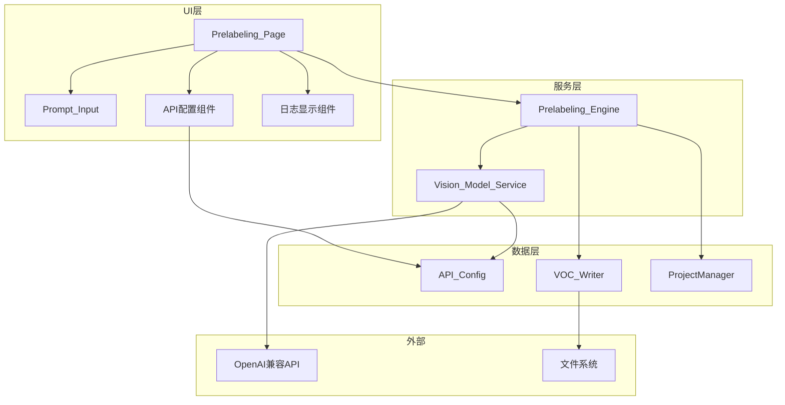
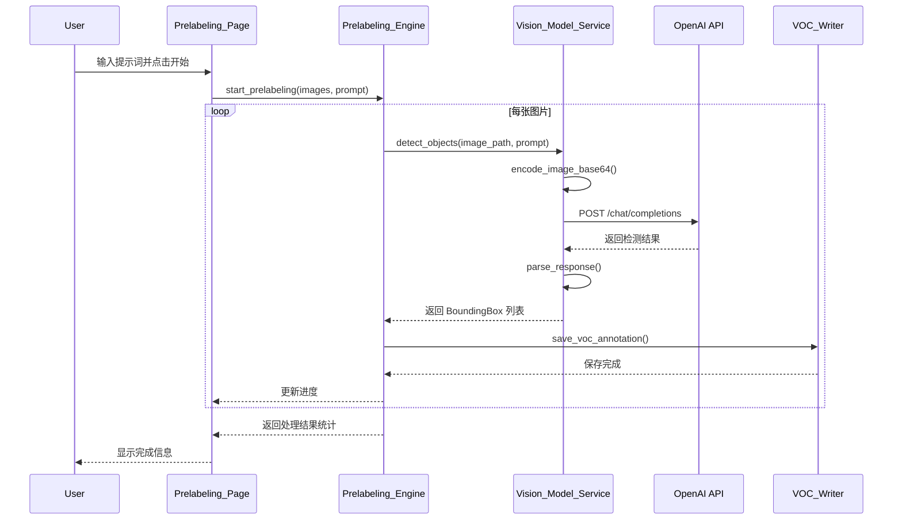

# 设计文档

## 概述

本设计文档描述视觉理解大模型预标注功能的技术实现方案。该功能将作为 ez_traing 应用程序的新页面模块，通过调用兼容 OpenAI API 规范的视觉大模型服务，对图片进行目标检测并生成 VOC 格式标注文件。

系统采用分层架构设计：
- **UI 层**：Prelabeling_Page 提供用户交互界面
- **服务层**：Vision_Model_Service 处理 API 通信，Prelabeling_Engine 协调整体流程
- **数据层**：API_Config 管理配置，VOC_Writer 生成标注文件

## 架构



### 数据流



## 组件与接口

### 1. API_Config（API 配置管理器）

负责 API 配置的存储和读取，配置保存在用户目录下的 JSON 文件中。

```python
from dataclasses import dataclass
from pathlib import Path
from typing import Optional
import json

@dataclass
class VisionAPIConfig:
    """视觉模型 API 配置"""
    endpoint: str = ""
    api_key: str = ""
    model_name: str = "gpt-4-vision-preview"
    timeout: int = 60

class APIConfigManager:
    """API 配置管理器"""
    CONFIG_FILE = "vision_api_config.json"
    
    def __init__(self):
        self._config: VisionAPIConfig = VisionAPIConfig()
        self._config_path: Path = self._get_config_path()
        self.load()
    
    def _get_config_path(self) -> Path:
        """获取配置文件路径"""
        config_dir = Path.home() / ".ez_traing"
        config_dir.mkdir(parents=True, exist_ok=True)
        return config_dir / self.CONFIG_FILE
    
    def load(self) -> None:
        """加载配置"""
        pass
    
    def save(self) -> None:
        """保存配置"""
        pass
    
    def get_config(self) -> VisionAPIConfig:
        """获取当前配置"""
        return self._config
    
    def update_config(self, endpoint: str = None, api_key: str = None, 
                      model_name: str = None, timeout: int = None) -> None:
        """更新配置"""
        pass
    
    def is_configured(self) -> bool:
        """检查配置是否完整"""
        return bool(self._config.endpoint and self._config.api_key)
    
    def get_masked_api_key(self) -> str:
        """获取脱敏的 API Key"""
        key = self._config.api_key
        if len(key) <= 8:
            return "*" * len(key)
        return key[:4] + "*" * (len(key) - 8) + key[-4:]
```

### 2. Vision_Model_Service（视觉模型服务）

负责与 OpenAI 兼容 API 进行通信，处理图片编码和响应解析。

```python
from dataclasses import dataclass
from typing import List, Optional, Tuple
import base64
import requests

@dataclass
class BoundingBox:
    """检测到的边界框"""
    label: str
    x_min: int
    y_min: int
    x_max: int
    y_max: int
    confidence: float = 1.0

@dataclass
class DetectionResult:
    """检测结果"""
    success: bool
    boxes: List[BoundingBox]
    error_message: str = ""
    raw_response: str = ""

class VisionModelService:
    """视觉模型服务"""
    
    SUPPORTED_FORMATS = {".jpg", ".jpeg", ".png", ".bmp", ".webp"}
    MIME_TYPES = {
        ".jpg": "image/jpeg",
        ".jpeg": "image/jpeg", 
        ".png": "image/png",
        ".bmp": "image/bmp",
        ".webp": "image/webp"
    }
    
    def __init__(self, config_manager: APIConfigManager):
        self._config_manager = config_manager
    
    def encode_image_base64(self, image_path: str) -> Tuple[str, str]:
        """将图片编码为 base64，返回 (base64_data, mime_type)"""
        pass
    
    def build_request_payload(self, base64_image: str, mime_type: str, 
                               prompt: str) -> dict:
        """构建 OpenAI API 请求体"""
        pass
    
    def detect_objects(self, image_path: str, prompt: str) -> DetectionResult:
        """调用模型检测图片中的目标"""
        pass
    
    def parse_response(self, response_text: str) -> List[BoundingBox]:
        """解析模型响应，提取边界框信息"""
        pass
```

### 3. Prelabeling_Engine（预标注引擎）

协调整体预标注流程，管理批量处理和进度报告。

```python
from dataclasses import dataclass
from typing import List, Callable, Optional
from PyQt5.QtCore import QThread, pyqtSignal

@dataclass
class PrelabelingStats:
    """预标注统计"""
    total: int = 0
    processed: int = 0
    success: int = 0
    failed: int = 0
    skipped: int = 0

class PrelabelingWorker(QThread):
    """预标注工作线程"""
    progress = pyqtSignal(int, int, str)  # current, total, message
    image_completed = pyqtSignal(str, bool, str)  # path, success, message
    finished = pyqtSignal(object)  # PrelabelingStats
    
    def __init__(self, image_paths: List[str], prompt: str,
                 vision_service: VisionModelService,
                 skip_annotated: bool = True,
                 overwrite: bool = False):
        super().__init__()
        self._image_paths = image_paths
        self._prompt = prompt
        self._vision_service = vision_service
        self._skip_annotated = skip_annotated
        self._overwrite = overwrite
        self._is_cancelled = False
    
    def run(self) -> None:
        """执行预标注"""
        pass
    
    def cancel(self) -> None:
        """取消处理"""
        self._is_cancelled = True
    
    def _has_annotation(self, image_path: str) -> bool:
        """检查图片是否已有标注"""
        pass
    
    def _save_voc_annotation(self, image_path: str, 
                             boxes: List[BoundingBox]) -> bool:
        """保存 VOC 格式标注"""
        pass
```

### 4. VOC_Writer（VOC 标注写入器）

封装现有的 PascalVocWriter，提供简化的接口。

```python
from typing import List, Tuple
from pathlib import Path

class VOCAnnotationWriter:
    """VOC 标注文件写入器"""
    
    def __init__(self):
        pass
    
    def save_annotation(self, image_path: str, image_size: Tuple[int, int, int],
                        boxes: List[BoundingBox], output_path: str = None) -> str:
        """
        保存 VOC 格式标注文件
        
        Args:
            image_path: 图片路径
            image_size: 图片尺寸 (height, width, depth)
            boxes: 边界框列表
            output_path: 输出路径，默认与图片同目录同名 .xml
            
        Returns:
            保存的文件路径
        """
        pass
    
    def _get_image_size(self, image_path: str) -> Tuple[int, int, int]:
        """获取图片尺寸"""
        pass
```

### 5. Prelabeling_Page（预标注页面）

提供预标注功能的用户界面。

```python
from PyQt5.QtCore import Qt, pyqtSignal
from PyQt5.QtWidgets import QWidget, QVBoxLayout
from qfluentwidgets import CardWidget

class PrelabelingPage(QWidget):
    """预标注页面"""
    
    def __init__(self, parent=None):
        super().__init__(parent)
        self._setup_ui()
        self._worker: Optional[PrelabelingWorker] = None
    
    def _setup_ui(self) -> None:
        """设置界面"""
        pass
    
    def _create_config_card(self) -> CardWidget:
        """创建 API 配置卡片"""
        pass
    
    def _create_prompt_card(self) -> CardWidget:
        """创建提示词输入卡片"""
        pass
    
    def _create_action_card(self) -> CardWidget:
        """创建操作按钮卡片"""
        pass
    
    def _create_log_card(self) -> CardWidget:
        """创建日志显示卡片"""
        pass
    
    def _on_start_clicked(self) -> None:
        """开始预标注"""
        pass
    
    def _on_cancel_clicked(self) -> None:
        """取消预标注"""
        pass
    
    def _on_progress(self, current: int, total: int, message: str) -> None:
        """处理进度更新"""
        pass
    
    def _on_finished(self, stats: PrelabelingStats) -> None:
        """处理完成"""
        pass
    
    def _log(self, message: str, level: str = "info") -> None:
        """添加日志"""
        pass
```

## 数据模型

### API 请求格式（OpenAI Vision API）

```json
{
  "model": "gpt-4-vision-preview",
  "messages": [
    {
      "role": "user",
      "content": [
        {
          "type": "text",
          "text": "用户提示词..."
        },
        {
          "type": "image_url",
          "image_url": {
            "url": "data:image/jpeg;base64,{base64_encoded_image}"
          }
        }
      ]
    }
  ],
  "max_tokens": 4096
}
```

### 期望的模型响应格式

模型需要返回 JSON 格式的检测结果，提示词中需要明确要求此格式：

```json
{
  "objects": [
    {
      "label": "目标类别名称",
      "bbox": [x_min, y_min, x_max, y_max],
      "confidence": 0.95
    }
  ]
}
```

### VOC 标注文件格式

```xml
<annotation>
    <folder>images</folder>
    <filename>image001.jpg</filename>
    <path>/path/to/image001.jpg</path>
    <source>
        <database>Unknown</database>
    </source>
    <size>
        <width>1920</width>
        <height>1080</height>
        <depth>3</depth>
    </size>
    <segmented>0</segmented>
    <object>
        <name>目标类别</name>
        <pose>Unspecified</pose>
        <truncated>0</truncated>
        <difficult>0</difficult>
        <bndbox>
            <xmin>100</xmin>
            <ymin>200</ymin>
            <xmax>300</xmax>
            <ymax>400</ymax>
        </bndbox>
    </object>
</annotation>
```

### 配置文件格式

存储在 `~/.ez_traing/vision_api_config.json`：

```json
{
  "endpoint": "https://api.openai.com/v1/chat/completions",
  "api_key": "sk-xxx...",
  "model_name": "gpt-4-vision-preview",
  "timeout": 60
}
```

## 正确性属性

*正确性属性是指在系统所有有效执行中都应该保持为真的特征或行为——本质上是关于系统应该做什么的形式化陈述。属性作为人类可读规范和机器可验证正确性保证之间的桥梁。*

### Property 1: 配置往返一致性

*对于任意* 有效的 API 配置（endpoint、api_key、model_name、timeout），保存配置后创建新的 APIConfigManager 实例加载配置，加载的配置应与原始配置完全一致。

**验证需求: 1.1, 1.2, 1.3, 1.4**

### Property 2: API 令牌脱敏格式

*对于任意* 长度大于 8 的 API 令牌字符串，脱敏后的结果应满足：长度与原始令牌相同，前 4 个字符与原始令牌相同，后 4 个字符与原始令牌相同，中间字符全部为 '*'。

**验证需求: 1.5**

### Property 3: 空提示词验证

*对于任意* 仅包含空白字符（空格、制表符、换行符）的字符串，预标注引擎应拒绝执行并返回验证错误。

**验证需求: 2.4**

### Property 4: 图片 Base64 编码往返

*对于任意* 支持格式的图片文件，编码为 base64 后解码应得到与原始文件相同的二进制内容。

**验证需求: 3.1**

### Property 5: 图片格式与 MIME 类型映射

*对于任意* 支持的图片格式（jpg、jpeg、png、bmp、webp），编码时应返回正确的 MIME 类型（image/jpeg、image/png、image/bmp、image/webp）。

**验证需求: 3.2, 3.4**

### Property 6: API 请求体结构

*对于任意* 有效的 base64 图片数据、MIME 类型和提示词，构建的请求体应包含：model 字段、messages 数组、messages[0].content 包含 text 和 image_url 两个元素、image_url.url 以 "data:{mime_type};base64," 开头。

**验证需求: 3.3**

### Property 7: 响应解析正确性

*对于任意* 符合预期格式的 JSON 响应（包含 objects 数组，每个对象有 label 和 bbox 字段），解析后的 BoundingBox 列表应与原始数据一一对应，且坐标值和标签完全匹配。

**验证需求: 4.3**

### Property 8: 异常响应处理

*对于任意* 不符合预期格式的响应字符串（非 JSON、缺少必要字段、字段类型错误），解析应返回失败结果并包含原始响应内容。

**验证需求: 4.5**

### Property 9: VOC 标注文件完整性

*对于任意* 图片路径、图片尺寸和边界框列表，生成的 VOC XML 文件应包含：正确的文件名、正确的图片尺寸、所有边界框的完整信息（label、xmin、ymin、xmax、ymax），且 XML 格式有效可解析。

**验证需求: 5.1, 5.4**

### Property 10: 标注文件路径

*对于任意* 图片路径，生成的标注文件路径应与图片在同一目录，文件名相同但扩展名为 .xml。

**验证需求: 5.3**

### Property 11: 批量处理统计一致性

*对于任意* 图片列表的批量处理结果，统计数据应满足：total = success + failed + skipped，且 processed = success + failed。

**验证需求: 6.6**

### Property 12: 取消处理有效性

*对于任意* 正在进行的批量处理，调用取消后，已处理数量应小于等于总数量，且处理应在合理时间内停止。

**验证需求: 6.4**

### Property 13: 未标注图片过滤

*对于任意* 包含已标注和未标注图片的列表，启用"仅处理未标注"选项时，实际处理的图片应仅包含未标注的图片。

**验证需求: 6.2**

### Property 14: 配置完整性验证

*对于任意* API 配置，当 endpoint 或 api_key 为空时，is_configured() 应返回 False；当两者都非空时应返回 True。

**验证需求: 8.1**

### Property 15: 错误恢复继续处理

*对于任意* 包含会导致处理失败的图片的列表，批量处理应继续处理后续图片，最终 failed 计数应等于失败图片数量，success 计数应等于成功图片数量。

**验证需求: 8.5**

## 错误处理

### 网络错误

- 连接超时：返回超时错误，建议用户检查网络或增加超时时间
- 连接拒绝：返回连接错误，建议用户检查 API 地址
- SSL 错误：返回 SSL 错误，建议用户检查证书配置

### API 错误

- 401 Unauthorized：返回认证错误，提示用户检查 API 令牌
- 429 Rate Limited：返回限流错误，建议用户稍后重试
- 500 Server Error：返回服务器错误，建议用户稍后重试

### 数据错误

- 图片读取失败：跳过该图片，记录错误日志
- 响应解析失败：记录原始响应，返回解析错误
- 文件写入失败：返回写入错误，提示用户检查权限

## 测试策略

### 单元测试

单元测试用于验证特定示例和边界情况：

- API 配置的保存和加载
- 令牌脱敏的边界情况（短令牌、空令牌）
- 各种图片格式的编码
- 各种响应格式的解析
- VOC 文件的生成和验证

### 属性测试

属性测试用于验证跨所有输入的通用属性：

- 使用 `hypothesis` 库进行属性测试
- 每个属性测试至少运行 100 次迭代
- 每个测试需要标注对应的设计属性编号
- 标注格式：**Feature: vision-model-prelabeling, Property {number}: {property_text}**

### 测试覆盖

- 配置管理：Property 1, 2, 14
- 图片处理：Property 4, 5, 6
- 响应解析：Property 7, 8
- 标注生成：Property 9, 10
- 批量处理：Property 11, 12, 13, 15
- 输入验证：Property 3

